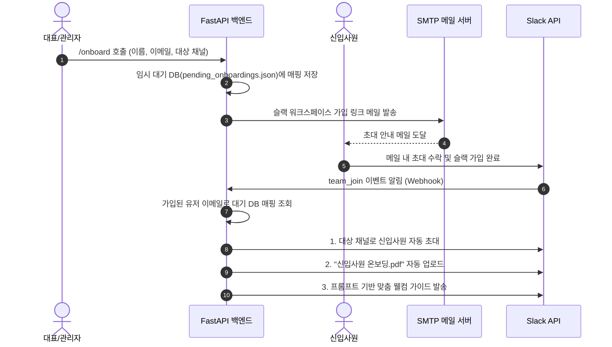

# 단기 근로자 및 신입사원 자동 온보딩 & RAG 챗봇 개발 기획서 (2차 개정안)

본 문서는 대표/프로젝트 관리자가 신규 입사자 정보를 입력하면 이메일로 슬랙 초대장을 자동 발송하고, 가입 완료 시 지정된 프로젝트 채널에 자동 참여시켜 온보딩 가이드와 서류를 자동 배포하며, RAG(검색 증강 생성) 기반으로 사내 질문에 답변하는 시스템의 상세 개발 기획서입니다.

---

## 1. 프로젝트 목적 및 추가 핵심 요구사항
* **목적**: 대표 및 관리자의 개입을 최소화하여 단기 근로자 및 신입사원이 워크스페이스에 합류하고 온보딩 과정을 마칠 수 있도록 자동화(AX).
* **추가 반영 사항**:
  1. **초대 양식 연동**: 관리자가 신입사원 정보(이름, 이메일, 초대할 프로젝트 채널)를 입력하여 온보딩을 트리거합니다.
  2. **가입 초대 자동화**: 지정된 이메일로 슬랙 워크스페이스 초대 링크 및 안내장을 발송합니다.
  3. **가입 감지 및 채널 자동 매핑**: 신입사원이 이메일의 링크를 수락하여 슬랙 워크스페이스(`slack-vjk8629.slack.com`)에 가입하는 즉시(`team_join` 이벤트 감지), 대표가 지정했던 채널로 자동 초대합니다.
  4. **프롬프트 기반 온보딩 요약**: 가입 완료 및 채널 입장 시 웰컴 템플릿 프롬프트를 사용하여 맞춤형 온보딩 요약 메시지를 전송하고, `"신입사원 온보딩.pdf"` 파일을 자동 업로드합니다.
  5. **RAG 온보딩 챗봇**: 봇 ID(`11195852603189.11183865847319`)로 온보딩 문서 및 과업지시서를 학습한 Ollama `gemma4:e4b` 모델이 채널 내 실시간 질의에 답변합니다.

---

## 2. 시스템 아키텍처 및 데이터 흐름도

---

## 3. 기능 구현 상세 계획

### 3.1. 이메일 초대 발송 모듈 (SMTP Integration)
* **API 설계**: `POST /onboard` 엔드포인트에서 이메일 전송 로직 수행.
* **이메일 본문**: 슬랙 워크스페이스 주소(`slack-vjk8629.slack.com`) 가입용 초대 URL과 매핑된 대상 채널명을 포함.
* **임시 매핑 정보 저장**: `pending_onboardings.json` 로컬 파일 데이터베이스를 구축하여 이메일 주소별 대상 채널(`channel_name` or `channel_id`)을 영속적으로 관리하고 가입 이벤트를 대기함.

### 3.2. 슬랙 `team_join` 이벤트 수신 및 자동 배치 모듈
* **이벤트 감지**: Slack Event Webhook `/slack/events`에서 `team_join` 이벤트를 파싱함.
* **프로세스**:
  1. 가입한 사용자의 이메일 주소를 획득.
  2. `pending_onboardings.json`에서 대상 채널 정보 조회.
  3. 존재 시, `slack_service.py`를 통해 사용자를 채널에 초대 (`conversations.invite`).
  4. 채널 초대 성공 후, `"신입사원 온보딩.pdf"` 문서를 업로드하고 웰컴 가이드 메시지 송출.
  5. 처리 완료 후 대기 데이터 삭제.

### 3.3. RAG 챗봇 연동 및 온보딩 문서 인덱싱
* **추가 문서 파싱**: `"신입사원 온보딩.pdf"` 파일이 감지되거나 업로드 시 자동으로 텍스트를 추출하여 Ollama 임베딩 모델(`nomic-embed-text`)을 통해 JSON Vector DB에 병합.
* **답변 품질 튜닝**: 챗봇은 과업지시서와 신입사원 온보딩 가이드를 혼합 참조하여 질문에 적절히 응답.

---

## 4. 환경 변수 및 설정 요구사항 (.env)
* **SMTP 메일 전송 설정**:
  - `SMTP_HOST`: 메일 발송 서버 호스트 (예: smtp.gmail.com)
  - `SMTP_PORT`: 포트 번호 (587 or 465)
  - `SMTP_USER`: 메일 계정 아이디
  - `SMTP_PASSWORD`: 메일 계정 앱 비밀번호
* **슬랙 워크스페이스 초대 정보**:
  - `SLACK_INVITE_URL`: 슬랙 워크스페이스 공유 초대 URL (`https://join.slack.com/...`)
  - `SLACK_BOT_ID`: `11195852603189.11183865847319`
