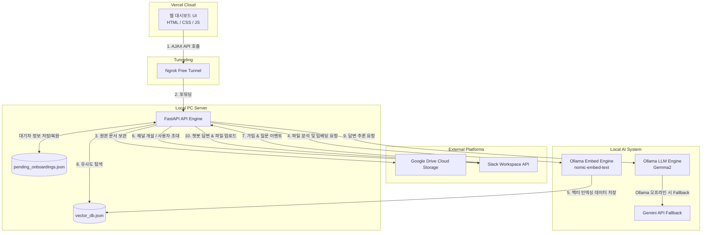
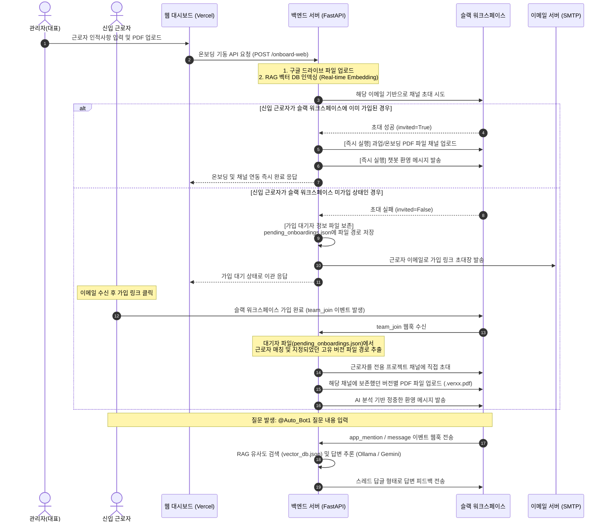

# 시스템 아키텍처 및 워크플로우 안내서

본 문서는 **단기 근로자 온보딩 자동화 및 실시간 RAG(Retrieval-Augmented Generation) 챗봇 시스템**의 전체 구조와 작동 흐름을 한눈에 이해할 수 있도록 설계된 공식 아키텍처 가이드라인입니다.

---

## 1. 시스템 아키텍처 (Architecture)

시스템은 외부에 호스팅되는 **프론트엔드(Vercel)**와 대표자(관리자)의 로컬 환경에서 구동되는 **백엔드 서버(FastAPI + Ngrok)** 및 **인공지능 모델 인프라(Ollama)**가 유기적으로 연동되는 하이브리드 아키텍처를 채택하고 있습니다.

### 1.1 개념 아키텍처 다이어그램

---

## 2. 주요 구성 요소 설명 (Components)

1. **프론트엔드 대시보드 (Vercel 호스팅)**
   - Glassmorphism(유리 질감) 테마가 적용된 관리자 전용 웹 대시보드입니다.
   - 근로자 기본 정보를 등록하고 드래그 앤 드롭으로 과업지시서와 온보딩 가이드 PDF를 간편하게 업로드할 수 있습니다.
   - 로컬 벡터 DB에 인덱싱된 문서 목록을 실시간으로 확인하고 선택해서 삭제할 수 있는 RAG 관리 창을 제공합니다.

2. **백엔드 API 서버 (FastAPI + Ngrok 터널링)**
   - 로컬 개발 환경에서 가동되며, Vercel과의 통신을 위해 Ngrok을 통한 보안 터널을 확보하고 CORS 보안을 우회 처리합니다.
   - 멀티파트 폼 데이터 수신, 구글 드라이브 업로드, RAG 임베딩, 슬랙 API 제어, 가입 대기자 영구 저장 및 슬랙 웹훅 이벤트를 핸들링합니다.

3. **로컬 RAG 검색 엔진 및 벡터 DB**
   - **임베딩**: `Ollama`의 `nomic-embed-text` 모델을 사용하여 업로드된 PDF의 문맥을 500자 단위 청크로 분할하여 로컬 `vector_db.json` 파일에 벡터화하여 인덱싱합니다.
   - **답변 추론**: 슬랙에서 질문이 들어왔을 때 관련 청크를 벡터 유사도(코사인 유사도)로 실시간 검색한 뒤 `Ollama` `Gemma2` 또는 `Gemini API`를 결합하여 상황에 최적화된 맞춤형 업무 지침 답변을 생성합니다.

4. **슬랙 연동 모듈 (Slack SDK)**
   - API를 사용하여 신입 근로자의 이메일 주소로 전용 OT 소통 채널(`#ot-proj-[이메일아이디]`)을 자동 개설하고 채널에 참여시킵니다.
   - PDF 자료 업로드 및 AI 생성 환영 메시지 배포를 관장합니다.

---

## 3. 핵심 워크플로우 (Workflow)

근로자의 슬랙 가입 상태에 따라 유동적으로 작동하는 **합류 시점 연동 지연 프로세스**가 포함되어 있습니다.

### 3.1 RAG 지식 베이스 선택적 청소 워크플로우
- 과업 지시서나 온보딩 문서가 변경되어 불필요하거나 중복된 구버전 지식 삭제가 필요할 때 다음과 같은 흐름으로 지식을 정리합니다.
1. **조회**: 대시보드 하단의 'RAG 지식 베이스 관리' 영역에서 `GET /rag/sources` API를 호출하여 현재 RAG 데이터베이스에 축적되어 있는 원본 파일명 리스트를 가져와 출력합니다.
2. **삭제 요청**: 관리자가 특정 PDF 소스를 선택하여 '삭제' 버튼을 클릭하면 `DELETE /rag/sources?source=[파일명]` API가 백엔드로 전송됩니다.
3. **영구 삭제**: 백엔드 서버는 `vector_db.json`에서 해당 파일명(`metadata.source`)을 가진 모든 청크 벡터 데이터를 일괄 제거(필터링)하고 파일 시스템에 갱신 및 저장합니다.
4. **리로드**: 삭제 성공 메시지 수신 후 대시보드 목록이 동적으로 갱신되며, 슬랙 채널에서 이전 지식에 대한 질문 시 챗봇은 삭제된 지식에 관해 답변하지 않습니다.
