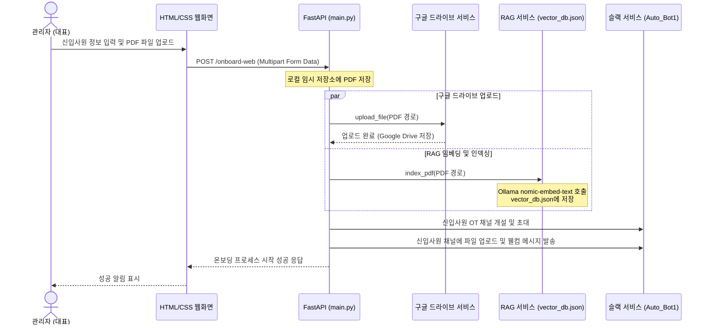

# 신규 기능 개발 기획: 온보딩 웹 프론트엔드 및 드라이브/RAG 자동 연동

본 기획서는 관리자(대표)가 웹 브라우저 상에서 신입사원의 정보 및 관련 과업지시서/온보딩 문서를 직접 입력하고 업로드하여 온보딩 프로세스를 시작할 수 있도록 하는 시스템 고도화 계획을 정의합니다. 업로드된 문서들은 구글 드라이브와 자동으로 연동되며, RAG(검색 증강 생성) 벡터 데이터베이스에 실시간 반영되어 슬랙 챗봇의 지식으로 축적됩니다.

---

## 1. 주요 요구사항 및 아키텍처 개요

1. **웹 프론트엔드 UI 구축**
   - 현대적이고 직관적인 Glassmorphism 및 Dark Mode 스타일의 Single Page UI 개발.
   - 입력 필드: 신입사원 이름, 이메일, 과업 프로젝트명.
   - 업로드 필드: 과업지시서 (PDF), 온보딩 가이드 (PDF).
   - API 통신 및 진행 상태(성공, 실패, 진행중) 실시간 상태 표시기.
   
2. **FastAPI 백엔드 파일 처리 API 추가**
   - `/onboard` 기존 엔드포인트를 확장하거나, 파일 업로드를 지원하는 새로운 `POST /onboard-web` 엔드포인트 구현.
   - 파일은 `multipart/form-data`로 전달받아 로컬에 임시 저장된 뒤 구글 드라이브 업로드 및 RAG 인덱싱 파이프라인으로 연결됨.
   - `/` 경로에 정적 파일(HTML, CSS, JS)을 제공하기 위해 `fastapi.staticfiles` 적용.

3. **구글 드라이브 연동 고도화 (`drive_service.py`)**
   - 구글 드라이브 API 권한 범위를 읽기 전용(`drive.readonly`)에서 파일 생성/수정 권한(`drive.file` 혹은 `drive`)으로 수정.
   - 로컬에 업로드된 과업지시서 및 온보딩 문서를 지정된 구글 드라이브 폴더(`GOOGLE_DRIVE_FOLDER_ID`)로 자동 업로드하는 `upload_file` 함수 개발.

4. **RAG 임베딩 실시간 업데이트 (`rag_service.py`)**
   - 업로드된 두 PDF 파일에 대해 실시간으로 `index_pdf`를 호출하여 로컬 벡터 DB(`vector_db.json`)에 임베딩 축적.
   - 이미 등록된 소스의 경우 중복 처리가 방지되는 기존 프리프로세싱을 활용하여 유연하게 데이터베이스 증감 처리.

5. **슬랙 챗봇 연동 및 지식 증감 확인**
   - 온보딩 채널 생성 및 신입사원 자동 초대.
   - 채널에 관련 파일 자동 업로드.
   - RAG 챗봇(`@Auto_Bot1`) 호출 시 업데이트된 벡터 DB를 조회하여 신입사원에게 최신 과업 내용을 바탕으로 명확한 가이드 제공.

---

## 2. 시스템 시퀀스 다이어그램

---

## 3. UI/UX 디자인 가이드라인

- **테마**: 심연의 어두운 배경(sleek dark mode)에 투명한 블러 처리를 적용한 유리 효과(glassmorphism).
- **글꼴**: Google Fonts의 `Outfit` 또는 `Inter` 적용.
- **애니메이션**: 버튼 호버 시 밝아지는 네온 효과, 파일 드래그 앤 드롭 영역 활성화 전환 효과, 온보딩 성공 시 축하 스프레이 효과 또는 마이크로 페이드인 애니메이션.
- **컴포넌트**:
  - 카드 형태의 글래스 대시보드
  - 단정한 텍스트 입력창과 예쁜 드롭다운(프로젝트 선택 등)
  - 파일 탐색 및 상태가 한눈에 보이는 드래그앤드롭 파일 업로더
  - 진행 및 결과 상황을 직관적으로 보여주는 로딩 프로그레스 및 모달 창

---

## 4. 파일별 변경 계획

### 백엔드 컴포넌트

1. **`config.py`**
   - 구글 드라이브 업로드에 필요한 Scopes 범위 수정 및 신규 웹 경로 정의.

2. **`drive_service.py`**
   - `SCOPES`를 `['https://www.googleapis.com/auth/drive']`로 변경.
   - `upload_file(file_path, folder_id)` 메서드 추가.

3. **`main.py`**
   - `StaticFiles`를 활용하여 `/static` 경로 매핑 및 루트 경로 `/`에서 `index.html` 서빙.
   - `POST /onboard-web` 엔드포인트를 추가하여 `Form` 데이터 및 `UploadFile` 수신.
   - 업로드 완료된 파일들에 대한 드라이브 업로드 및 RAG 연동 백그라운드 태스크 기획.

### 프론트엔드 컴포넌트

1. **`static/index.html` [NEW]**
   - 관리자용 근로자 정보 및 파일 업로드 화면 정의.

2. **`static/style.css` [NEW]**
   - 현대적이고 수려한 Glassmorphism 테마 디자인 및 애니메이션 이펙트 정의.

3. **`static/app.js` [NEW]**
   - 파일 드래그 앤 드롭 핸들링, 입력 유효성 검사, API 호출 및 UI 상태 변경 관리.
